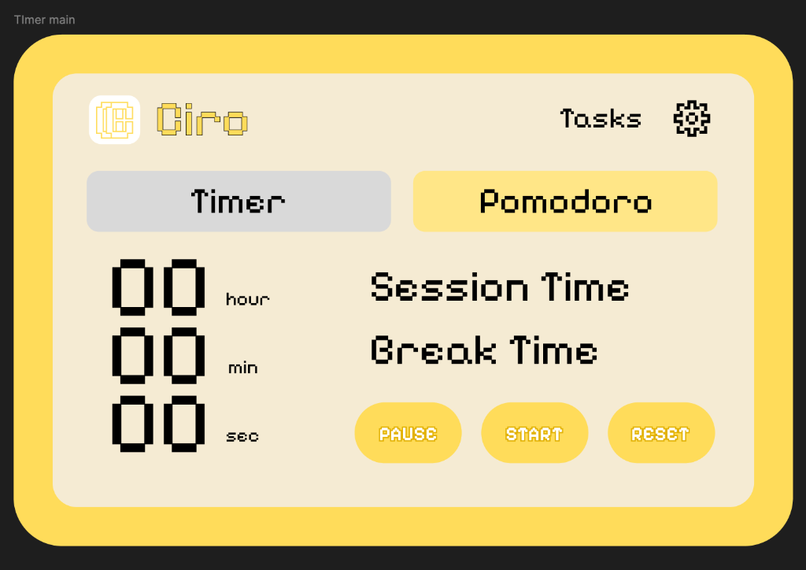
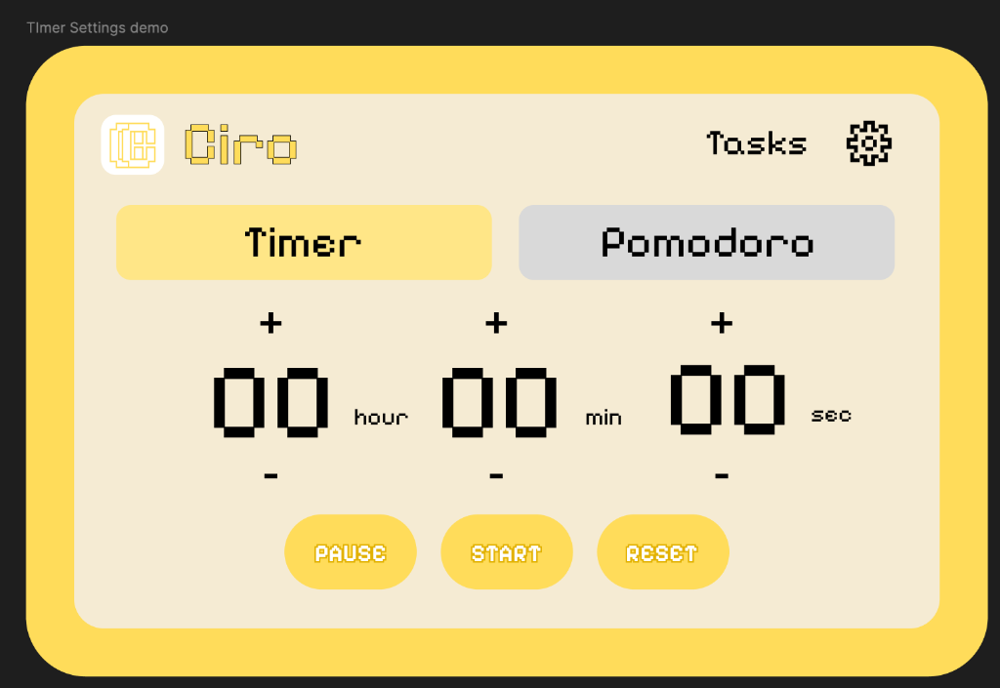

# Ciro

Ciro is a pixel-themed browser extension for productivity.
It includes a timer, pomodoro mode, floating widget, and task manager in a minimal interface.

---

## Screenshots

---

## Features

* Timer with start, pause, and reset
* Pomodoro mode with sessions
* Floating mini timer
* Task list with add, complete, and delete
* Theme and emoji customization
* Sound alert on completion

---

## Installation

1. Clone the repository
2. Open chrome://extensions/
3. Enable Developer Mode
4. Click Load Unpacked and select the folder

---

## Tech Stack

* HTML
* CSS
* JavaScript
* Chrome Extension (Manifest V3)

---

## Author

Your Name
